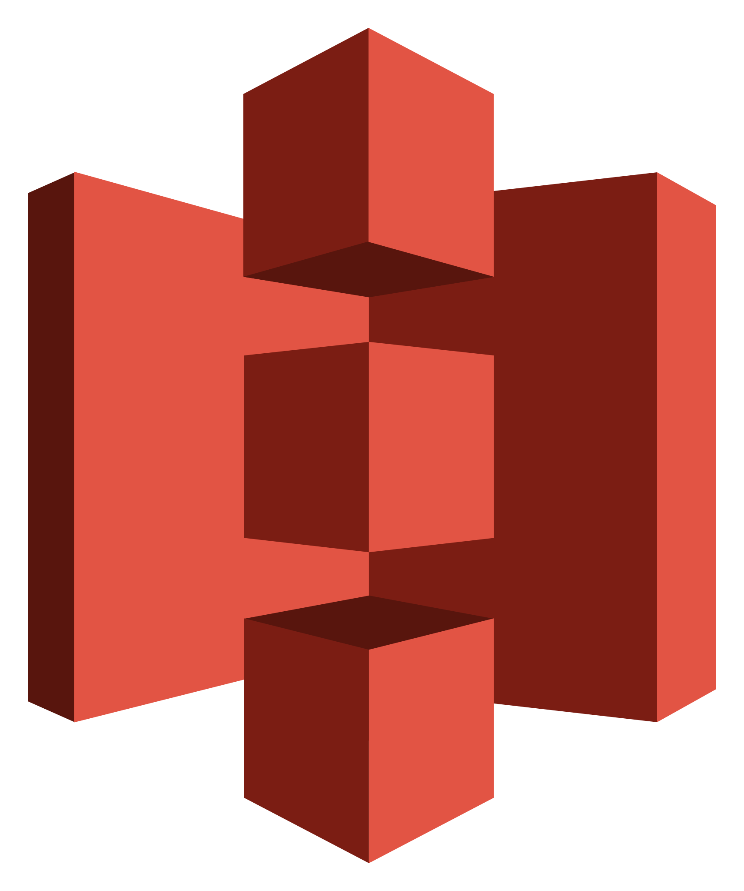

# Teste Engenharia de dados Franq

# Visão de processo da arquitetura

## Camadas principais

1. Camada de extração

Responsável pela busca do dado nas fontes disponíveis.

2. Camada de Armazenamento

Responsável pela armazenamento dos dados em estado bruto e também limpos e trasformados.

3. Camada de transformação

Responsável pela limpeza, normalização e adequação às regras de negócios.

4. Camada de visualização

Responsável pela interface com o usuário final, disponibilizando gráficos e dashboards.

## Camadas de Apoio 

5. Camada de orquestração

Responsável pela ordenamento dos pipelines de dados.

6. Camada de catalogação

Responsável pela documentação dos dados, proprietários de tabelas e linhagens.

# Visão de ferramentas da arquitetura

1. Camadas de extração

Scripts pythons fariam a extração dos dados podendo ser via web scrapping direto na fonte, ou usando api's de bases ja tratadas como no caso do cnpj, encontrado nesse [link](https://basedosdados.org/dataset/br-me-cnpj?bdm_table=empresas). Usando uma lógica simples, o script irá somente baixar o dado e transformar para uma extensão mais leve e colunas, como por exemplo o parquet.

2. Armazenamento

Com a extração feita pela camada anterior, poderíamos armazenar no S3, na qual proporciona um baixo orçamento e não há necessidade de gerenciar um banco de data warehouse. O S3 seria dividido em três partes:

Zona Raw: Para armazenamento do dado Bruto
Zona Processed: Para limpeza e normalização dos dados
Zona Trusted: Para criação e agregação de tabelas com regras de negócios

3. Transformação

Para que o dado transite da zona raw até a trusted, essas duas ferramentas fariam a parte de transformação. O DBT permite que você escreva, teste e documente através de arquivos SQL e yaml, no qual na minha opinião é mais acessível do que escrever em python. Como o DBT não tem acesso direto com o S3, instalaremos um plugin do athena, que é um serviço que nos dará a capacidade de ler o S3 como um banco SQL.

4. Visualização

Com os dados chegando na zona trusted, podemos ligar o metabase na base para podermos fazer nossas visualizações. Para isso também precisaremos instalar um plugin do athena no Metabase.

5. Orquestração

Para que todo esse pipeline seja gerenciado, podemos subir um aiflow para montarmos essas dags e assim poder controlar performance e possiveis quebras.

6. Catalogação

Para que possamos usar o S3 como banco, usaremos a parte de catalogação do Glue para definição de tabelas e databases.

# Disclaimer sobre infra

Sem restrição financeira, usaria os serviços pagos do ariflow,dbt cloud e metabase cloud.
Com restrições, subiria uma instancia no EC2 para cada um.

Subiria todos os serviços que dependem de algum componente da AWS usando Terraform para poder gerenciar a infra.

